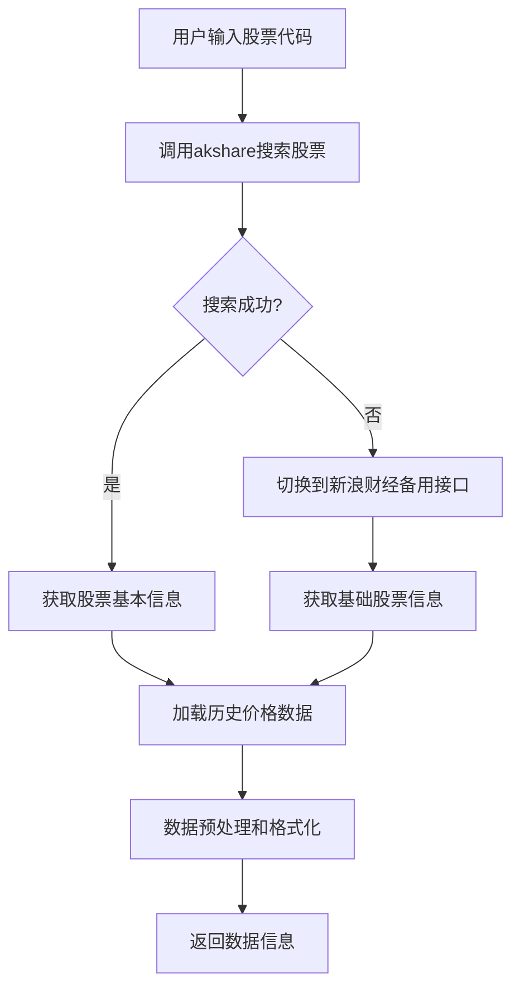
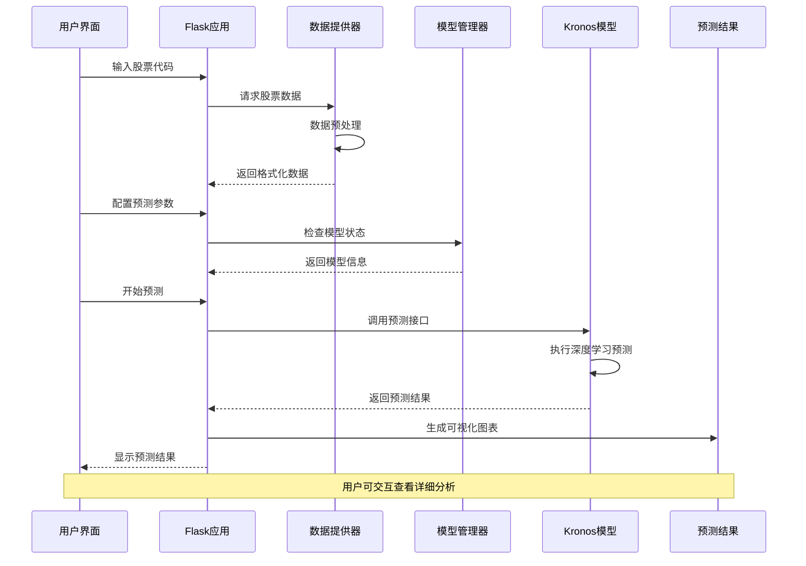

# Kronos 股票走势预测系统逻辑文档

## 项目概述

Kronos 是一个基于深度学习的金融时间序列预测系统，专门用于股票价格走势预测。系统采用 Flask + Plotly 架构，集成 Kronos 深度学习模型，提供完整的股票数据获取、模型预测和可视化分析功能。

## 系统架构

### 核心组件

1. **Web 应用层** (`app.py`)
   - Flask Web 服务器
   - RESTful API 接口
   - 模型管理和预测调度

2. **数据获取层** (`akshare_data_provider.py`)
   - 股票数据获取（akshare + 新浪财经备用）
   - 交易日历管理
   - 数据预处理和格式化

3. **模型管理层** (`direct_model_loader.py`)
   - Kronos 模型自动扫描和加载
   - 模型状态监控
   - 预测参数配置

4. **预测引擎层** (`kronos.py`)
   - Kronos 深度学习模型
   - 时间序列预测算法
   - 多步预测和采样策略

5. **前端界面层** (`templates/index.html`)
   - 响应式 Web 界面
   - 交互式图表展示
   - 实时状态监控

## 股票走势预测完整流程

### 第一阶段：数据准备

#### 1.1 股票数据获取


**关键API接口：**
- `POST /api/akshare/search-stock` - 股票搜索
- `POST /api/akshare/get-stock-data` - 历史数据获取

**数据格式：**
```python
{
    "symbol": "sh600159",
    "name": "股票名称", 
    "latest_price": "当前价格",
    "change_rate": "涨跌幅",
    "historical_data": [
        {
            "date": "2024-01-01",
            "open": 10.5,
            "high": 11.2,
            "low": 10.3,
            "close": 10.8,
            "volume": 1000000
        }
    ]
}
```

#### 1.2 交易日历集成
- 自动识别交易日和非交易日
- 支持交易日模式选择（自动/仅交易日/所有日期）
- 预测时间轴智能调整

### 第二阶段：模型加载

#### 2.1 模型自动扫描
```python
# 模型扫描逻辑（direct_model_loader.py）
def scan_models():
    # 扫描 local_models 和 models 目录
    # 识别有效的 Kronos 模型文件
    # 按模型大小和质量排序
    # 返回可用模型列表
```

#### 2.2 模型状态管理
- 实时监控模型加载状态
- 自动故障恢复机制
- 多模型热切换支持

**模型状态API：**
- `GET /api/model-status` - 模型状态检查
- `POST /api/load-model` - 手动加载模型
- `GET /api/available-models` - 可用模型列表

### 第三阶段：预测参数配置

#### 3.1 时间窗口选择
- **固定窗口大小**：400（回看）+ 120（预测）= 520个数据点
- **滑动窗口机制**：通过时间滑块选择预测起始位置
- **数据点映射**：将时间范围映射到固定数据点数量

#### 3.2 预测参数调节

| 参数 | 作用 | 范围 | 默认值 |
|------|------|------|--------|
| 温度 (Temperature) | 控制预测随机性 | 0.1-2.0 | 1.0 |
| 核心采样 (Top-p) | 控制预测多样性 | 0.1-1.0 | 0.9 |
| 样本数量 | 生成多个预测样本 | 1-5 | 1 |

### 第四阶段：预测执行

#### 4.1 预测请求处理
```python
# 预测API处理流程（app.py）
@app.route('/api/predict', methods=['POST'])
def predict():
    # 1. 验证输入参数
    # 2. 加载股票数据
    # 3. 数据预处理和标准化
    # 4. 调用Kronos模型预测
    # 5. 结果后处理和格式化
    # 6. 生成可视化图表
    # 7. 返回预测结果
```

#### 4.2 Kronos模型预测流程
```python
# Kronos模型预测逻辑（kronos.py）
class KronosPredictor:
    def predict(self, data, lookback=400, pred_len=120):
        # 1. 数据标准化
        # 2. 构建输入序列（400个历史点）
        # 3. 模型前向传播
        # 4. 多步预测生成（120个未来点）
        # 5. 结果反标准化
        # 6. 返回预测序列
```

### 第五阶段：结果展示和分析

#### 5.1 可视化图表生成
- **主图表**：历史数据 + 预测结果对比
- **交互功能**：缩放、平移、数据点悬停
- **多曲线显示**：开盘价、最高价、最低价、收盘价

#### 5.2 预测质量评估

**误差指标计算：**
- **MAE（平均绝对误差）**：预测值与实际值的平均绝对差异
- **RMSE（均方根误差）**：预测误差的平方根平均值
- **MAPE（平均绝对百分比误差）**：相对误差的平均值

#### 5.3 对比分析表格
- 时间点对齐的实际值和预测值对比
- 各价格维度（开、高、低、收）的详细误差
- 交易日历信息集成

## 关键技术特性

### 1. 容错机制
- **网络重试**：akshare接口3次重试 + 指数退避
- **备用数据源**：主接口失败时自动切换到新浪财经
- **模型热备**：多模型自动切换和故障恢复

### 2. 性能优化
- **数据缓存**：频繁访问数据的本地缓存
- **批量预测**：支持多股票代码批量预测
- **异步处理**：耗时操作的异步执行

### 3. 用户体验
- **实时状态**：模型加载和数据获取的实时进度显示
- **智能提示**：操作指导和错误信息的友好展示
- **响应式设计**：适配不同屏幕尺寸的设备

## 数据流图



## 错误处理策略

### 1. 数据获取错误
- **网络超时**：30秒超时 + 重试机制
- **数据缺失**：智能填充或跳过异常数据点
- **接口限制**：备用数据源自动切换

### 2. 模型预测错误
- **模型加载失败**：自动尝试其他可用模型
- **预测异常**：参数验证和边界检查
- **内存溢出**：分批处理和内存监控

### 3. 用户输入错误
- **股票代码验证**：格式检查和存在性验证
- **参数范围检查**：自动修正超出范围的参数
- **数据完整性**：输入数据的完整性验证

## 扩展性设计

### 1. 数据源扩展
- 支持多种数据源（腾讯财经、东方财富等）
- 自定义数据适配器接口
- 混合数据源支持

### 2. 模型扩展
- 支持多种深度学习架构
- 模型插件化设计
- 在线学习能力

### 3. 功能扩展
- 多时间粒度预测（分钟、小时、日线）
- 技术指标集成
- 风险预警系统

## 部署和运维

### 1. 环境要求
- Python 3.8+
- PyTorch 1.9+
- 必要的第三方依赖包

### 2. 启动流程
```bash
# 1. 安装依赖
pip install -r requirements.txt

# 2. 启动服务
python app.py --port 8080

# 3. 访问界面
http://localhost:8080
```

### 3. 监控指标
- 模型加载状态
- 预测准确率统计
- 系统资源使用情况
- API响应时间监控

## 总结

Kronos 股票走势预测系统提供了一个完整的端到端解决方案，从数据获取到预测结果展示的每个环节都经过精心设计。系统具有高度的容错性、可扩展性和用户友好性，能够满足金融时间序列预测的复杂需求。

通过模块化的架构设计和智能的错误处理机制，系统能够在各种异常情况下保持稳定运行，为用户提供可靠的股票走势预测服务。